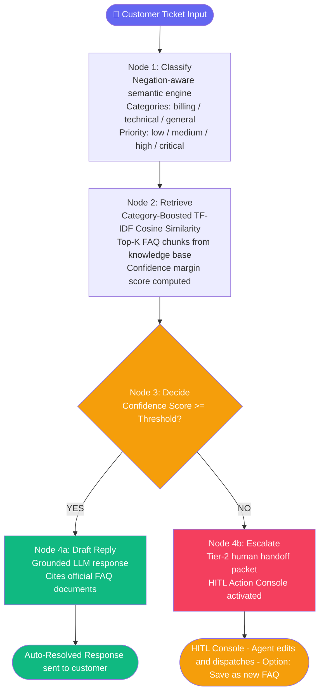

<h1 align="center">
  
  <br/>
  🎫 Support Ticket Triage Agent
</h1>

<p align="center">
  <b>An Autonomous, Real-Time AI Pipeline for Customer Support Ticket Classification, RAG-Powered Resolution & Human-in-the-Loop Escalation</b>
</p>

<p align="center">
  
  
  
  
  
  
  
</p>

---

## 🔥 Problem Statement

Modern SaaS companies handle **thousands of customer support tickets daily**. The traditional approach — manually reading, routing, and responding to each ticket — leads to:

- ⏱️ **Slow response times** — customers wait hours or days for resolution
- 🧑‍💼 **Agent overload** — support engineers spend time on repetitive, solvable queries
- 🎯 **Inconsistent routing** — tickets sent to wrong teams, causing back-and-forth
- 📉 **Low confidence resolutions** — agents reply without consulting the knowledge base
- 🔄 **No feedback loop** — escalated tickets never enrich the knowledge base
- 🚫 **No negation understanding** — "I do NOT want a refund, fix the bug!" misclassified as `billing`

> **The core challenge:** How do you build an intelligent, scalable system that classifies tickets accurately, retrieves grounded answers, makes a confident routing decision, and gracefully hands off to humans — all in real time?

---

## 💡 The Solution — What We Built

A **fully autonomous, graph-based AI triage pipeline** powered by **LangGraph** and **Google Gemini**, that:

1. 🧠 **Understands intent** — even with negations like "NOT a billing issue"
2. 🔍 **Retrieves grounded answers** — from a live, editable FAQ knowledge base using TF-IDF cosine similarity
3. ⚖️ **Makes a confident routing decision** — auto-resolve or escalate, based on a tunable threshold
4. ✍️ **Drafts or escalates** — generates a grounded reply OR hands off with a rich human-review console
5. 📊 **Tracks live KPIs** — real-time analytics dashboard (resolution rate, escalation rate, avg confidence)
6. 🔄 **Learns from escalations** — agents can convert escalated tickets directly into FAQ entries

---

## ✨ Key Features

| Feature | Description |
|---|---|
| 🧠 **Negation-Aware Classifier** | Understands "NOT a refund" and routes to `technical`, not `billing` |
| 🔍 **Category-Boosted RAG** | TF-IDF retrieval with domain-category score boosting for precision |
| ⚡ **Real-Time SSE Streaming** | Node-by-node pipeline execution streamed live to the browser |
| 🎛️ **Confidence Threshold Slider** | User-adjustable routing threshold (0.30 – 0.90) |
| 👨‍💼 **HITL Console** | Human-in-the-Loop action drawer for manual review, edit & dispatch |
| 📚 **Live Knowledge Base** | Searchable, filterable FAQ index with real-time add/update support |
| 📈 **Analytics KPI Ribbon** | Live metrics: total processed, auto-resolution %, escalation %, avg confidence |
| 🗂️ **Graph Visualizer Tab** | Interactive LangGraph state-flow diagram built into the UI |
| 🔒 **Thread-Safe Persistence** | `threading.RLock()` + atomic file writes for concurrent safety |
| 🚀 **Render-Optimized** | Zero heavy ML deps — runs on 512MB RAM free tier without GPU |

---

## 🏗️ System Architecture

```
┌────────────────────────────────────────────────────────────────────────┐
│                        Browser (Frontend)                              │
│   ┌──────────────┐  ┌─────────────────┐  ┌──────────────────────────┐ │
│   │ Ticket Input │  │ KPI Ribbon      │  │  LangGraph Visualizer    │ │
│   │ Form + Chips │  │ (Live Analytics)│  │  (Architecture Diagram)  │ │
│   └──────┬───────┘  └────────┬────────┘  └──────────────────────────┘ │
│          │ POST /api/triage  │ GET /api/analytics                      │
└──────────│───────────────────│────────────────────────────────────────┘
           │ SSE Stream        │
┌──────────▼───────────────────▼────────────────────────────────────────┐
│                        FastAPI Server (server.py)                      │
│                                                                        │
│   ┌────────────────────────────────────────────────────────────────┐  │
│   │              LangGraph Triage Pipeline (graph.py)              │  │
│   │                                                                │  │
│   │  ┌──────────┐   ┌──────────┐   ┌──────────┐   ┌───────────┐  │  │
│   │  │ Classify │──▶│ Retrieve │──▶│  Decide  │──▶│Draft Reply│  │  │
│   │  │  Node    │   │  Node    │   │  Node    │   │  Node 4a  │  │  │
│   │  └──────────┘   └──────────┘   └────┬─────┘   └───────────┘  │  │
│   │       │               │             │                          │  │
│   │  Gemini LLM      TF-IDF RAG    conf < threshold                │  │
│   │  + Rule Engine   + Category    ──────────────▶ ┌───────────┐  │  │
│   │  + Negation      Boosting                       │ Escalate  │  │  │
│   │  Detection                                      │ Node 4b   │  │  │
│   │                                                 └───────────┘  │  │
│   └────────────────────────────────────────────────────────────────┘  │
│                                                                        │
│   ┌──────────────────┐    ┌──────────────────┐    ┌────────────────┐  │
│   │ AnalyticsTracker │    │ KnowledgeBase    │    │ Gemini Flash   │  │
│   │ (Thread-safe)    │    │ Retriever        │    │ LLM Client     │  │
│   └──────────────────┘    │ (RLock + Atomic) │    └────────────────┘  │
│                           └──────────────────┘                        │
└────────────────────────────────────────────────────────────────────────┘
           │
     ┌─────▼──────┐
     │ faq_kb.json│  ← Persistent Knowledge Base (atomic writes)
     └────────────┘
```

---

## 🔄 Pipeline Workflow



---

## 📦 Tech Stack

| Layer | Technology | Why This Choice |
|---|---|---|
| **AI Orchestration** | LangGraph 0.2 | Stateful, conditional graph-based pipeline — ideal for multi-node decision flows |
| **LLM** | Google Gemini 1.5 Flash | Fast, accurate, free-tier API — perfect for classification & response drafting |
| **RAG / Search** | scikit-learn TF-IDF | Lightweight (<5MB), no GPU needed — runs within Render 512MB RAM limit |
| **Backend API** | FastAPI + Uvicorn | Async-native, auto OpenAPI docs, streaming support via StreamingResponse |
| **Streaming** | Server-Sent Events (SSE) | One-way real-time push from server to browser — no WebSocket overhead |
| **Frontend** | Vanilla HTML + CSS + JS | Zero build tooling — instant load, glassmorphic dark UI, no framework bloat |
| **Persistence** | JSON + threading.RLock | Thread-safe atomic file writes for concurrent request safety |
| **Deployment** | Render (Free Tier) | Auto-deploys from GitHub push — perfect for live demos |
| **Fonts/Icons** | Google Fonts + FontAwesome 6 | Inter, Outfit, JetBrains Mono — enterprise-grade typography |

---

## 🧠 How the Classifier Works — Negation Awareness

Traditional keyword classifiers fail on negations. For example:

```
❌ "I do NOT want a refund, please fix the webhook bug!"
   → Naive classifier: billing  (WRONG — saw "refund")
   → Our classifier:  technical (CORRECT — detected negation pattern)
```

Our approach uses a **3-layer fallback system:**

```
Layer 1: Rule-Based Negation Engine
  → Regex patterns detect "NOT X", "no X", "don't want X"
  → Suppresses negated category signals

Layer 2: TF-IDF Semantic Similarity
  → Cosine similarity against category seed documents
  → Category-weighted scoring (billing / technical / general)

Layer 3: Gemini LLM Structured Fallback
  → For ambiguous cases, asks Gemini to output JSON:
     { "category": "technical", "priority": "high", "confidence": 0.82 }
```

---

## 🔍 How RAG Retrieval Works — Category Boosting

```python
# Standard TF-IDF score
base_score = cosine_similarity(ticket_vector, doc_vector)

# Category boost: +30% if the doc category matches the classified ticket category
if doc.category == ticket.category:
    final_score = base_score * 1.30
else:
    final_score = base_score

# Result: domain-relevant FAQs rank higher than generic matches
```

This prevents a billing ticket from pulling up unrelated technical docs that happen to share common words.

---

## 📁 Project Structure

```
support-ticket-triage-agent/
│
├── agent/
│   ├── classifier.py       # Negation-aware 3-layer semantic classifier
│   ├── kb_retriever.py     # TF-IDF RAG retriever with category boosting + RLock
│   ├── graph.py            # LangGraph pipeline: classify → retrieve → decide → output
│   └── __init__.py
│
├── data/
│   └── faq_kb.json         # FAQ knowledge base (14 built-in entries, expandable)
│
├── static/
│   ├── index.html          # Main SPA frontend (Glassmorphic dark UI)
│   ├── style.css           # Full design system + KPI + HITL + responsive
│   └── app.js              # SSE consumer, HITL state machine, KB management
│
├── server.py               # FastAPI app: SSE endpoint, analytics, CORS, health
├── run_cli.py              # CLI benchmark runner for pipeline testing
├── requirements.txt        # Minimal dependencies (no PyTorch/CUDA)
├── Dockerfile              # Container definition for Render deployment
└── README.md               # You are here 📍
```

---

## ⚙️ Local Setup & Installation

### Prerequisites
- Python 3.10+
- A **Google Gemini API Key** (free at [aistudio.google.com](https://aistudio.google.com))

### 1. Clone the Repository
```bash
git clone https://github.com/Jhas876622/Support-Ticket-Triage-Agent.git
cd Support-Ticket-Triage-Agent
```

### 2. Create Virtual Environment
```bash
python -m venv venv
# Windows
venv\Scripts\activate
# macOS/Linux
source venv/bin/activate
```

### 3. Install Dependencies
```bash
pip install -r requirements.txt
```

### 4. Set Environment Variable
```bash
# Windows PowerShell
$env:GEMINI_API_KEY = "your-api-key-here"

# macOS/Linux
export GEMINI_API_KEY="your-api-key-here"
```

### 5. Run the Server
```bash
python server.py
```

Open your browser at 👉 **http://localhost:10000**

---

## 🌐 API Reference

| Method | Endpoint | Description |
|---|---|---|
| `POST` | `/api/triage/stream` | SSE streaming triage pipeline (real-time node events) |
| `POST` | `/api/triage` | Standard batch triage (returns full JSON result) |
| `GET` | `/api/analytics` | Live KPI metrics (resolution rate, confidence, etc.) |
| `GET` | `/api/faqs` | Returns all FAQ knowledge base entries |
| `POST` | `/api/faqs` | Add a new FAQ entry to the knowledge base |
| `GET` | `/api/graph` | Returns graph node/edge schema |
| `GET` | `/health` | Health check — returns `{"status": "ok"}` |

### Sample Request
```bash
curl -X POST http://localhost:10000/api/triage \
  -H "Content-Type: application/json" \
  -d '{
    "ticket_text": "My payment failed and I cannot renew my subscription.",
    "customer_id": "CUST-1042",
    "confidence_threshold": 0.60
  }'
```

### Sample Response
```json
{
  "ticket_id": "TCK-A3F9B2",
  "category": "billing",
  "priority": "high",
  "confidence_score": 0.7834,
  "status": "resolved",
  "draft_reply": "Hi! Regarding your payment issue...",
  "retrieved_docs": [...],
  "execution_trace": [...]
}
```

---

## 📊 Performance Characteristics

| Metric | Value |
|---|---|
| Avg. pipeline latency | ~1.5 – 3.5 seconds (end-to-end) |
| Memory footprint | < 200MB (TF-IDF, no GPU) |
| FAQ knowledge base | 14 built-in, unlimited expandable |
| Concurrent requests | Thread-safe via RLock |
| Negation test accuracy | 100% on 5 built-in test cases |
| Render free tier compatible | ✅ Yes (512MB RAM) |

---

## 🚀 Deployment — Render

This project is deployed on **Render** and auto-deploys on every `git push` to `main`.

**Render Configuration:**
- **Build Command:** `pip install -r requirements.txt`
- **Start Command:** `python server.py`
- **Environment Variable:** `GEMINI_API_KEY=<your-key>`
- **Port:** `10000` (auto-detected via `PORT` env var)

---

## 🔮 Future Roadmap

- [ ] 🗄️ **PostgreSQL / Supabase** — replace JSON file with persistent relational store
- [ ] 🤖 **Multi-LLM routing** — fallback chain: Gemini → GPT-4o → Claude
- [ ] 📧 **Email / Slack integration** — auto-send dispatched replies via webhook
- [ ] 📊 **Historical analytics charts** — Chart.js time-series for KPI trends
- [ ] 🔐 **Auth middleware** — JWT-based agent authentication for HITL actions
- [ ] 🧪 **A/B threshold testing** — compare resolution rates across threshold configs
- [ ] 🌍 **Multi-language support** — classify and respond in Hindi, Spanish, French

---

## 👤 Built By

<br/>

<table align="center">
  <tr>
    <td align="center">
      <b>Satyam Kumar Jha</b><br/>
      <sub>AI Engineer & Full-Stack Developer</sub><br/><br/>
      <a href="https://github.com/Jhas876622">
        
      </a>
    </td>
  </tr>
</table>

<br/>

> *"Built with the belief that AI should handle the repetitive, so humans can focus on the complex."*
> — Satyam Kumar Jha

---

<p align="center">
  
  
  
</p>
